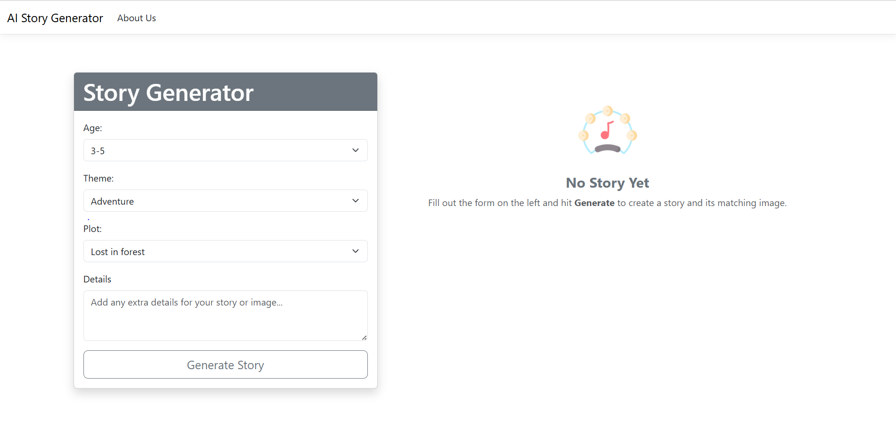
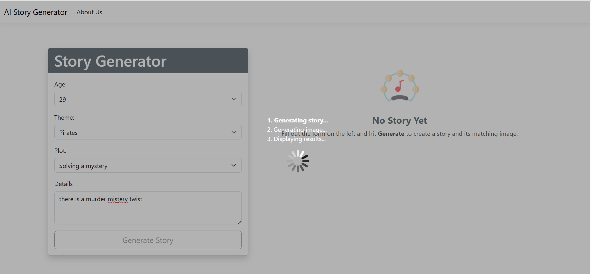
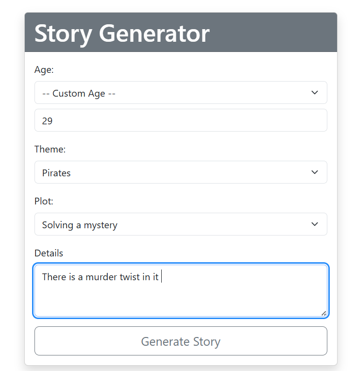
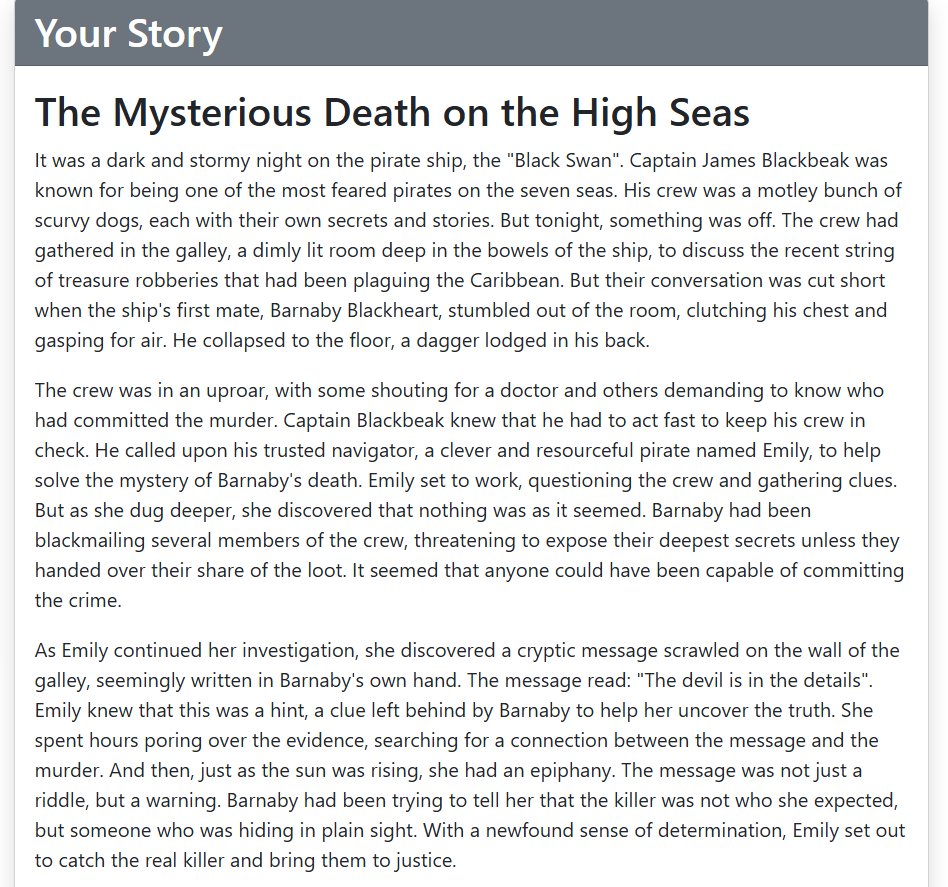
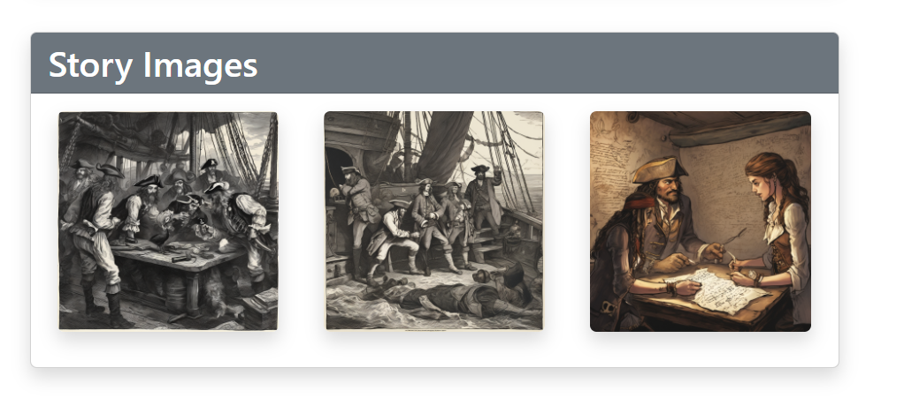
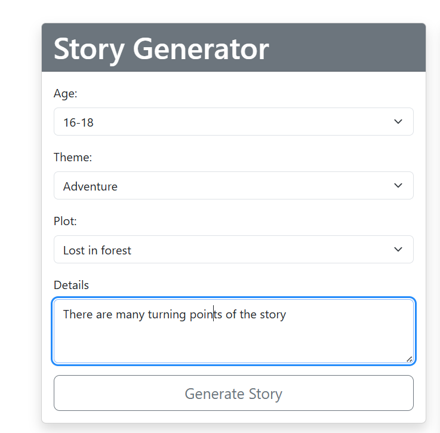
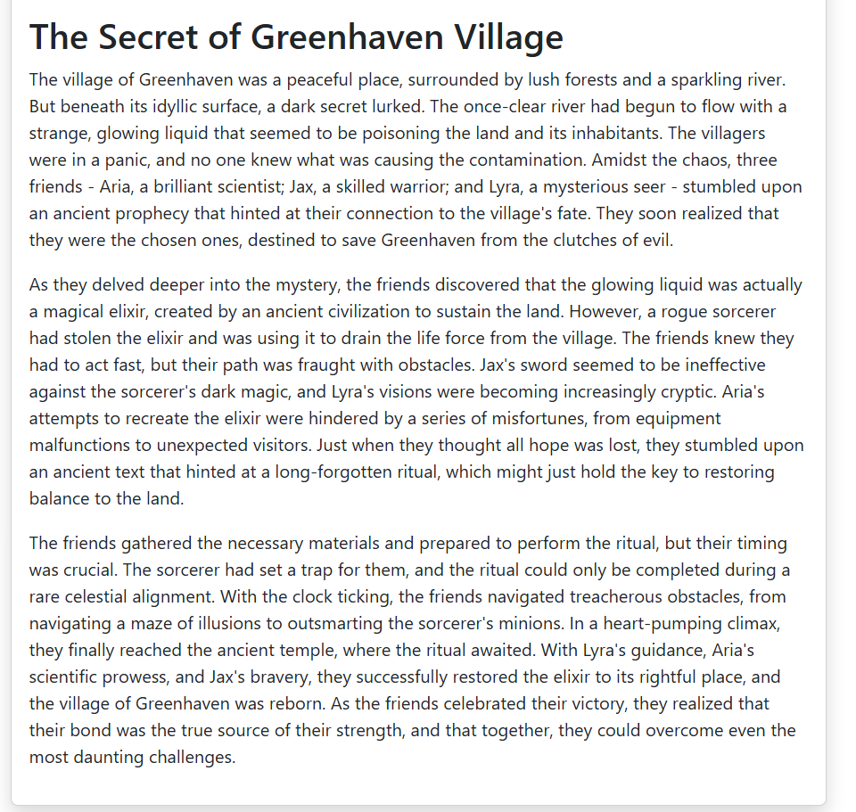
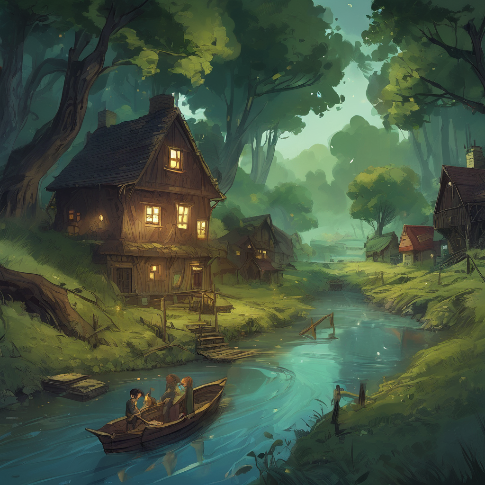
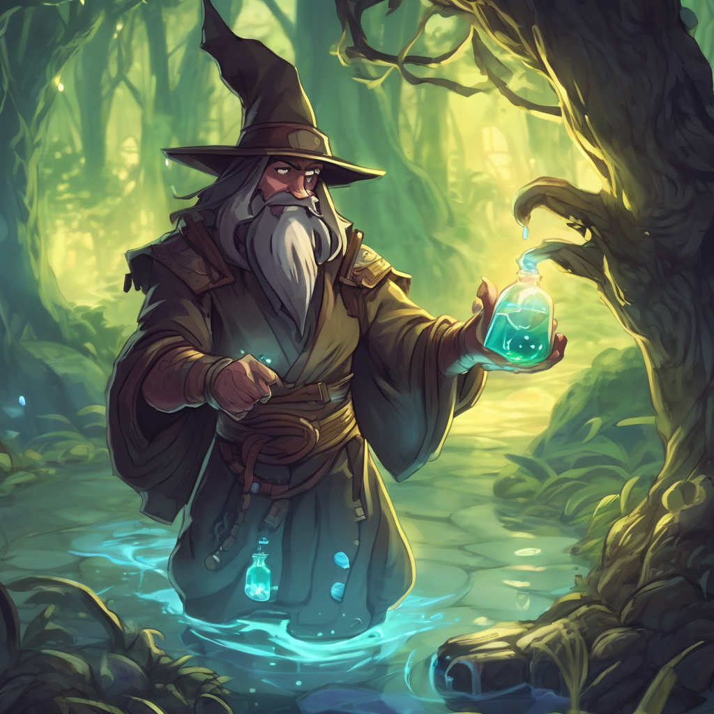
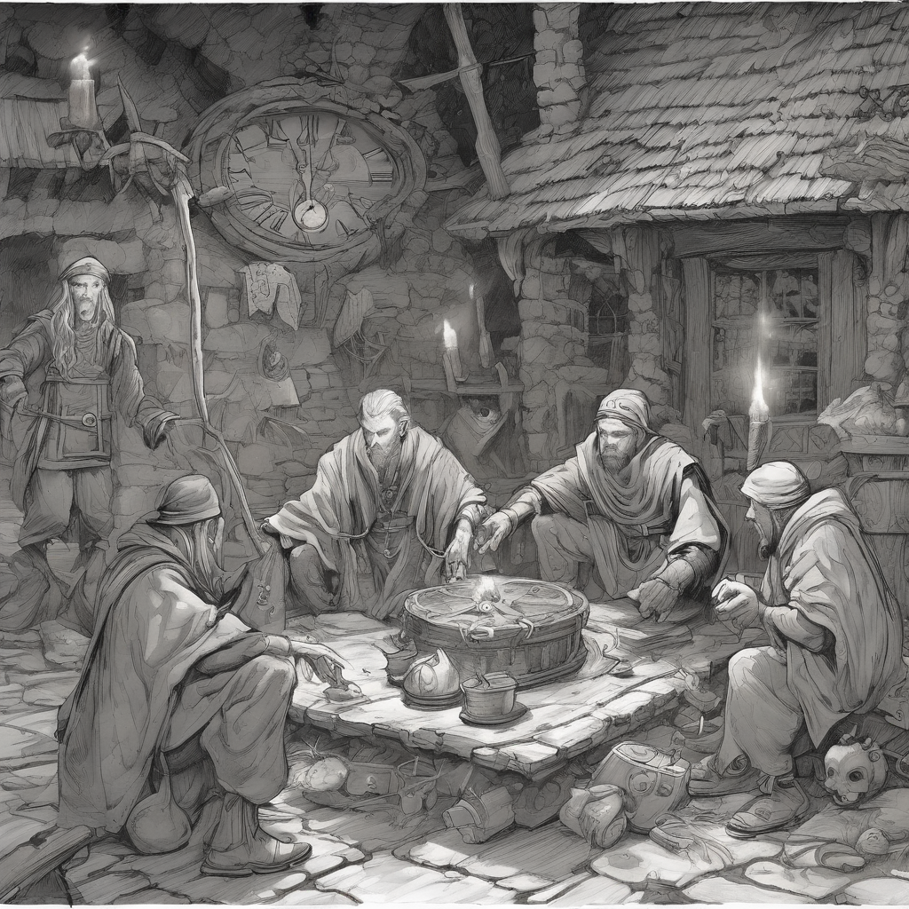

# 🧠 AI Story Generator (ASP.NET Core MVC, .NET 9)

Create **personalized stories for all age groups** and **matching AI-generated illustrations**! Select or enter an **age group**, **theme**, and **plot**, add optional details, and generate a **3-paragraph HTML story** with **AI-created images** for each paragraph.

---

## 🖼️ Project Screenshots

### 🏠 Default Section (Homepage & About Page)

* 
* 
* 

### 📚 Story Group 1

* 
* 
* 
* 
* 
* 

### 📚 Story Group 2

* 
* 
* 
* 
* 

---

## 📚 About

The **Story Generator** is an AI-powered web app built with **ASP.NET Core MVC (.NET 9)**. It allows users to generate creative, age-appropriate stories and corresponding illustrations using **Groq**, **Hugging Face**, and **Stability AI** APIs.

💡 Perfect for:

* Bedtime stories
* Classroom creativity
* Fun & educational storytelling

---

## 🚀 Tech Stack

| Layer             | Technology                                                               |
| ----------------- | ------------------------------------------------------------------------ |
| **Backend**       | ASP.NET Core MVC (.NET 9)                                                |
| **HTTP Client**   | `IHttpClientFactory`                                                     |
| **Story AI**      | Groq API (Llama 3.3 70B Versatile / Llama 3.1 8B Instant / Mixtral 8x7B) |
| **Image AI**      | Hugging Face Inference API → Stability AI fallback                       |
| **Frontend**      | Razor Views, Bootstrap 5, JS Loader                                      |
| **Language**      | C# 12                                                                    |
| **Configuration** | appsettings.json / User Secrets                                          |

---

## ✨ Features

### 🎭 Preset + Custom Inputs

| Field       | Preset Options                                                                                                    | Custom Option            |
| ----------- | ----------------------------------------------------------------------------------------------------------------- | ------------------------ |
| **Age**     | 3–5, 6–8, 9–12, 13–15, 16–18                                                                                     | User can enter their own |
| **Theme**   | Adventure, Friendship, Magic, Animals, Space, Pirates, Dragons                                                    | User can enter their own |
| **Plot**    | Lost in forest, Treasure hunt, Saving the village, Finding a new friend, Solving a mystery, Winning a competition | User can enter their own |
| **Details** | Free-form text area                                                                                               | Optional hints for AI    |

---

### 🧩 AI Story Generation

* Uses **Groq** with Llama 3 models:

  * `llama-3.3-70b-versatile`
  * `llama-3.1-8b-instant`
  * fallback `mixtral-8x7b-32768`
* Produces structured **HTML**:

```html
<h2>Story Title</h2>
<p>Paragraph 1...</p>
<p>Paragraph 2...</p>
<p>Paragraph 3...</p>
```

---

### 🎨 AI Image Generation

* Builds prompts with: theme + plot + paragraph + details
* Tries Hugging Face models sequentially:

  1. `stabilityai/stable-diffusion-xl-base-1.0`
  2. `stabilityai/stable-diffusion-2-1`
  3. `runwayml/stable-diffusion-v1-5`
  4. `prompthero/openjourney-v4`
  5. `dreamlike-art/dreamlike-photoreal-2.0`
  6. `CompVis/stable-diffusion-v1-4`
  7. `wavymulder/Analog-Diffusion`
  8. `nitrosocke/Arcane-Diffusion`
  9. `hakurei/waifu-diffusion`
  10. `dgkanatsios/DalleMini`
* Falls back to **Stability AI** (`stable-diffusion-xl-1024-v1-0`) if needed.

---

## ⚙️ How It Works

### 🏠 `HomeController`

* `GET /Home/Index` → loads dropdowns.
* `POST /Home/Index` → builds prompts, generates story, and creates per-paragraph images.
* `GenerateStoryAsync` uses Groq (Llama 3.x models) → extracts title & paragraphs.
* `GenerateImageBase64Async` → tries Hugging Face → Stability AI fallback.

### 📄 Views

* **Views/Home/Index.cshtml** — Main story generator UI.
* **Views/Home/About.cshtml** — Project description.

---

## 🔑 Configuration

```json
{
  "Groq": { "ApiKey": "YOUR_GROQ_API_KEY" },
  "HuggingFace": { "ApiKey": "YOUR_HUGGINGFACE_API_KEY" },
  "StabilityAI": { "ApiKey": "YOUR_STABILITY_API_KEY_OPTIONAL" }
}
```

Use **User Secrets** for local development:

```bash
dotnet user-secrets init
dotnet user-secrets set "Groq:ApiKey" "YOUR_GROQ_API_KEY"
dotnet user-secrets set "HuggingFace:ApiKey" "YOUR_HF_API_KEY"
dotnet user-secrets set "StabilityAI:ApiKey" "YOUR_STABILITY_API_KEY"
```

---

## 🧩 Getting Started

```bash
git clone https://github.com/FurqanMujahid/AI_Story_Generator
cd AI_Story_Generator
dotnet restore
dotnet build
dotnet run
```

App runs on:
➡️ `https://localhost:5001` or `http://localhost:5000`

---

## ⚠️ Notes & Limitations

* Groq must return proper HTML tags (`<h2>`, `<p>`)
* Hugging Face may return 503 while models warm up
* Custom options reset on app restart
* If all image APIs fail → only text story appears

---

## 🔒 Security

* Never commit API keys.
* Use secure secret management in production.

---

## 🛣️ Roadmap

* Implement `/Home/GenerateTitleImage`
* Persist user inputs (session/DB)
* Add model selector & export to PDF
* Add moderation filters

---

## 🧾 License

```
MIT License
© 2025 Story Generator Project
```

---

## ❤️ Acknowledgements

* [Groq](https://groq.com/) — Fast Llama 3 models
* [Hugging Face](https://huggingface.co/) — Image generation
* [Stability AI](https://stability.ai/) — Fallback image models
* [Bootstrap](https://getbootstrap.com/) — Frontend styling
